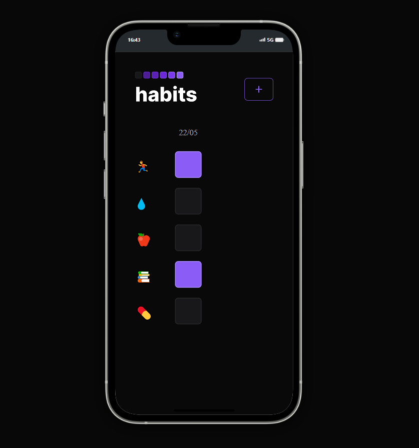

# Projeto de Gerenciamento de Hábitos ☑
Este projeto de gerenciamento de hábitos foi desenvolvido para ajudar as pessoas a acompanhar e manter seus hábitos diários de forma simples e eficiente. Os usuários podem adicionar o dia atual e marcar os hábitos que cumpriram, como correr, tomar água, comer, estudar e tomar remédio. ☑👨‍🔧

 

### Preview Desktop / Mobile

#
### Funcionalidades
Adicionar o dia atual: Permite ao usuário registrar o dia de hoje para acompanhar seus hábitos.
Marcar hábitos cumpridos: Caixinhas de seleção para registrar os hábitos diários, como:
- Correr
- Tomar água
- Comer
- Estudar
- Tomar remédio

Visualização do progresso: Fornece uma visão geral do progresso dos hábitos ao longo do tempo.
#
### Tecnologias utilizadas:
- HTML5: Estrutura do projeto.
- CSS3: Estilização e layout.
- JavaScript: Funcionalidades e interatividade.

 

LinkedIn: [linkedin.com/in/paulohrs01](https://www.linkedin.com/in/paulohrs01/)